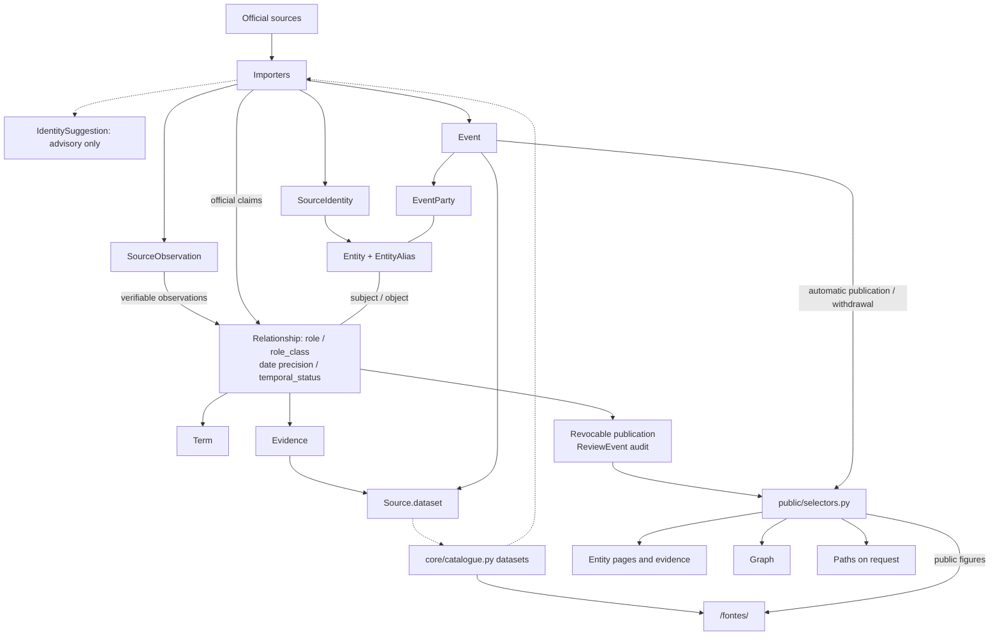

# Database architecture

The [models](../apps/platform/ligacoes/core/models.py) are authoritative for the schema. See [sources](sources.md) and the public [sources page](/fontes/) for official datasets, [methodology](methodology.md) for editorial policy and [operations](operations.md) for procedures.

## Application shape

One Django project on PostgreSQL: the web service serves public pages and the admin; an import worker handles queued `ImportRun` jobs. A separate refresh service uses the same image with restricted database credentials. Scheduling, commands and recovery belong in [operations](operations.md).

## Data model and flow

## Invariants

### One visibility rule
Every public surface (pages, evidence, graph, counts, paths, event aggregates) reads through [`public/selectors.py`](../apps/platform/ligacoes/public/selectors.py). Relationships require publication approval, both endpoints public and public evidence from a public source; events require a public source and every party public. A slug or UUID is never authorisation; private review data is never exposed.

### Editorial lock and revocable publication
Editorial writes, reviews and snapshot applies are serialised by one PostgreSQL advisory lock. Publication is a revocable permission, not an export; `ReviewEvent` records claim decisions. Editing a published relationship, its entities, sources or evidence invalidates approval. Imports never override editorial withdrawal of a claim or event.

Bulk imports acquire the lock once. Nested writes on the same connection share the complete atomic scope without PostgreSQL savepoints; a nested failure invalidates that scope even if caught. Ordinary editorial transactions retain savepoint-isolated recovery. Bulk mode is bound to the active database scope and expires in copied contexts too; neither another connection nor later work can bypass the lock.

### Identity
- People reuse an official `SourceIdentity` (scheme + identifier), or exactly one namesake corroborated by S1: overlapping institutional relationships, including immediate `part_of` neighbours; S2: an imported Wikidata AR/EP crosswalk linking an incoming EP identifier to an AR profile; S3: AR suspension and Government entry within ±15 days, in either import order; or S4: an AR office overlapping a recorded AR status interval. Wikidata and non-effective AR statuses corroborate identity, never supply evidence for a public office.
- Distinct identifiers in the same scheme exclude matching, except EpT holder IDs; `scoped_name` excludes matching within the same source scope, not across scopes. Uncorroborated or ambiguous namesakes get separate public profiles and advisory suggestions, not a publication gate. Rejected suggestions and explicit `IdentityDecision` distinct-person decisions block automatic reconciliation.
- Name-only people use `scoped_name`; organisations resolve by valid legal NIPC, then a unique anchored name/alias match, otherwise reusable `declared_name`. Natural-person NIFs are never stored.
- Indexed `Entity.normalised_name` and official `EntityAlias` names support matching without PostgreSQL extensions.

`link_identities` can reconcile even already-used public profiles when names/official aliases and the same corroboration signals give an unambiguous match; it also unifies the AR institution's official AR/NIPC anchors. The retained person profile prefers AR, Government, EpT, EP, then scoped-name anchors, breaking equal ranks by the oldest mapping. Ordinary mapping edits and suggestion acceptance still cannot redirect a used identity; audited reconciliation is the deliberate exception.

Each merge is atomic under the editorial lock: identifiers, aliases, observations, relationship endpoints and event parties move to the retained entity, with immutable `IdentityMerge` provenance and an `EntityRedirect`. Independent source-owned claims and evidence remain separate, with their dates, editorial withdrawals and rejected identity decisions preserved; relationships that would become self-links are withdrawn. Event summaries rebuild transactionally. Reconciliation changes identity attribution, not the meaning or evidential strength of a source's assertion.

Each merge rescans its complete current namesake component under that lock, including new candidates; cached proposals alone never authorise a merge. Global scans between passes detect newly enabled matches without repeatedly rescoring unrelated namesakes.

Both profiles must be public, including the AR/NIPC institution match: reconciliation cannot revive events hidden by editorial entity visibility. A later merge preserves an earlier audit's original target as a hidden historical shell; only public redirects follow the new canonical entity.

Merged-away entities disappear from public listings; a hidden historical shell remains only while referenced. Public profile, event-list and graph URLs permanently redirect to the same surface for the retained public entity, preserving filters and canonicalising an event counterpart slug. A live public slug takes precedence, and a private target is never disclosed.

### Automatic publication
Every verifiable observation publishes automatically with a source URL and minimal passage, including declared interests and explicit biography role/organisation assertions. Incomplete or kind-incompatible observations remain private and count as skipped. Editorial withdrawal blocks republication; source changes and returns invalidate approval before automatic republication. Source-specific boundaries belong in [methodology](methodology.md).

### Parliamentary ownership
AR mandate history and absence are owned by each legislature's snapshot, not a global roster. Only effective periods become offices; other statuses remain private identity context. Bodies imports own parliamentary groups, committees, delegations and friendship groups, never plenary mandates.

### Events
Events are n-ary records with `EventParty` roles, not binary claims. Automatic publication requires every party to be public and identifier-anchored. Undated profile and graph queries use derived per-entity and per-pair summaries of exactly `public_events()`; dated queries aggregate on request. Summary rebuilds materialise eligible events and distinct parties once, then run bounded aggregates inside the transaction changing events, parties or visibility. Summaries never become claims.

### Derived paths
"Como estão ligados?" paths are computed on request from published claims (optionally public events), excluding hubs by default. They are never stored as claims.

### Imports
The atomic unit is a complete snapshot per scope: validation failure rolls it back under the editorial lock, including streamed batches. Absence ceases records only in that scope; older snapshots cannot replace newer ones. Minimised, fingerprinted observations remain separate from editable claims. Queue recovery and multi-scope command boundaries belong in [operations](operations.md).

### Presentation
Search and counterpart filters are accent- and case-insensitive: tokens match word starts within an entity name or one official alias; exact matches rank first. Declared interests are a reading layer after officially documented connections, labelled as the person's declaration rather than independently checked facts and dated by declaration.

The graph is supplementary: relationships and evidence remain readable outside it, including temporal uncertainty and coverage limits. Colour encodes connection kind, never party affiliation; entity kinds use shapes.
