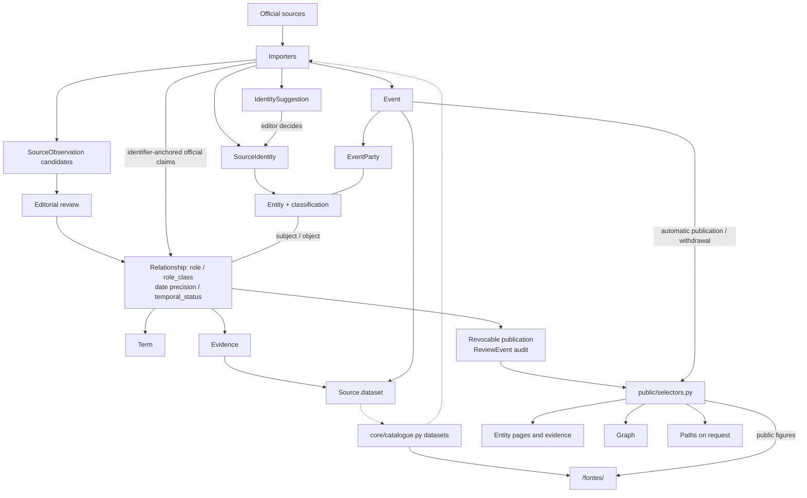

# Database architecture

The [models](../apps/platform/ligacoes/core/models.py) are authoritative for the schema. See [sources](sources.md) and the public [sources page](/fontes/) for official datasets, [methodology](methodology.md) for editorial policy and [operations](operations.md) for procedures.

## Application shape

One Django project on PostgreSQL: a web service serves public pages and the admin; an import worker uses the same image and database for slow official-source requests. Imports are operator-invoked, through management commands or queued `ImportRun` jobs, never scheduled.

## Data model and flow

## Invariants

### One visibility rule
Every public surface (pages, evidence, graph, counts, paths, event aggregates) reads through [`public/selectors.py`](../apps/platform/ligacoes/public/selectors.py) for both relationships and events. A slug or UUID is never authorisation; private review data is never exposed.

### Editorial lock and revocable publication
Editorial writes, reviews and snapshot applies are serialised by one PostgreSQL advisory lock. Publication is a revocable permission, not an export; `ReviewEvent` records claim decisions. Editing a published relationship, its entities, sources or evidence invalidates approval. Imports never override editorial withdrawal of a claim or event.

### Identity
- Automatic matching uses official identifiers (`SourceIdentity`: scheme + identifier), never names. Once used, a mapping is immutable and cannot be deleted.
- Suggest before create: when an official person identifier matches a public namesake, a pending `IdentitySuggestion` blocks creation until an editor decides.
- Wikidata produces hints and suggestions only, never evidence.
- Natural-person NIFs are never stored.

### Automatic versus reviewed publication
- Identifier-anchored official offices, parliamentary memberships and organisational structure publish automatically, with no human reviewer; editors can withdraw them.
- Name-only subjects, declared interests and biography roles stay private `SourceObservation` candidates until an editor converts and publishes them. Identifiers alone do not make declared interests eligible for automatic publication.
- The [methodology](methodology.md) defines source-specific boundaries, including parliamentary groups rather than party affiliation.

### Events
Contracts, subsidies, funds, meetings, hearings, gifts, hospitality and travel are n-ary `Event` records with `EventParty` roles, not binary claims. Automatic publication requires every party to be a public, identifier-anchored entity; natural persons are dropped from organisation datasets. Profile and graph aggregates come from `public_events()`, not stored as relationships: without an observed date they are read from derived summary tables (per entity and per pair of entities, never claims) that hold exactly what `public_events()` yields and are rebuilt in the transaction that changes an event, its parties, an entity's visibility or a dataset source's visibility; with a date they are computed on request.

### Derived paths
"Como estão ligados?" paths are computed on request from published claims (optionally public events), excluding hubs by default. They are never stored as claims.

### Imports
The atomic unit is a complete snapshot per scope: validation failure rolls it back under the editorial lock, including streamed batches. Absence ceases records in that scope; older snapshots cannot replace newer ones. Private, minimised, fingerprinted observations remain separate from editable claims. Changes, departures and returns invalidate dependent approval; only eligible official claims can republish automatically. Queue recovery and multi-scope command boundaries belong in [operations](operations.md).

### Presentation
The graph is supplementary: relationships and evidence remain readable outside it, including temporal uncertainty and coverage limits. Colour encodes connection kind, never party affiliation; entity kinds use shapes. The shared palette stays away from Portuguese party colours.
